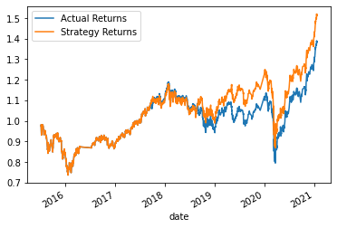
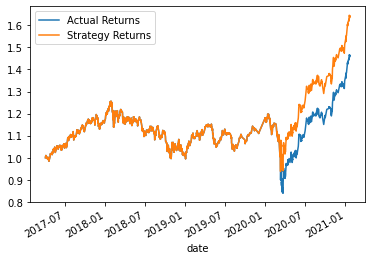
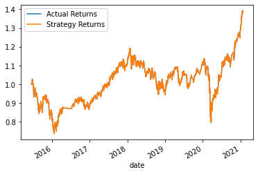
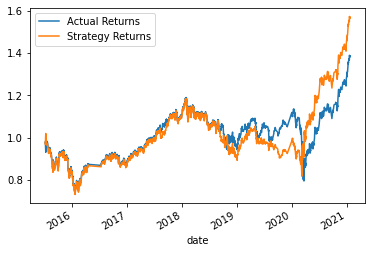
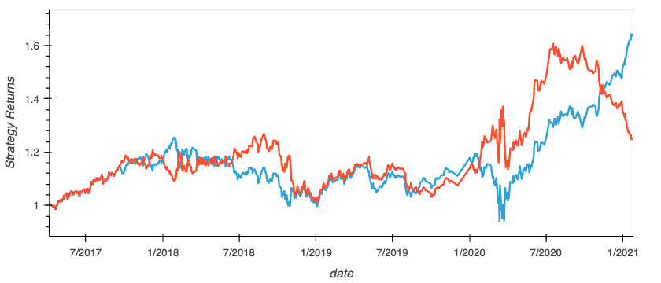

# AnthonyQuiles-Machine_Learning_Trading_Bot
## Module 14
# Machine Learning Trading Bot - Challenge

In this Challenge, you’ll assume the role of a financial advisor at one of the top five financial advisory firms in the world. Your firm constantly competes with the other major firms to manage and automatically trade assets in a highly dynamic environment. In recent years, your firm has heavily profited by using computer algorithms that can buy and sell faster than human traders.

The speed of these transactions gave your firm a competitive advantage early on. But, people still need to specifically program these systems, which limits their ability to adapt to new data. You’re thus planning to improve the existing algorithmic trading systems and maintain the firm’s competitive advantage in the market. To do so, you’ll enhance the existing trading signals with machine learning algorithms that can adapt to new data.

## Instructions:

Use the starter code file to complete the steps that the instructions outline. The steps for this Challenge are divided into the following sections:

* Establish a Baseline Performance

* Tune the Baseline Trading Algorithm

* Evaluate a New Machine Learning Classifier

* Create an Evaluation Report

#### Establish a Baseline Performance

In this section, you’ll run the provided starter code to establish a baseline performance for the trading algorithm. To do so, complete the following steps.

Open the Jupyter notebook. Restart the kernel, run the provided cells that correspond with the first three steps, and then proceed to step four. 

1. Import the OHLCV dataset into a Pandas DataFrame.

2. Generate trading signals using short- and long-window SMA values. 

3. Split the data into training and testing datasets.

4. Use the `SVC` classifier model from SKLearn's support vector machine (SVM) learning method to fit the training data and make predictions based on the testing data. Review the predictions.

5. Review the classification report associated with the `SVC` model predictions. 

6. Create a predictions DataFrame that contains columns for “Predicted” values, “Actual Returns”, and “Strategy Returns”.

7. Create a cumulative return plot that shows the actual returns vs. the strategy returns. Save a PNG image of this plot. This will serve as a baseline against which to compare the effects of tuning the trading algorithm.

8. Write your conclusions about the performance of the baseline trading algorithm in the `README.md` file that’s associated with your GitHub repository. Support your findings by using the PNG image that you saved in the previous step.

#### Tune the Baseline Trading Algorithm

In this section, you’ll tune, or adjust, the model’s input features to find the parameters that result in the best trading outcomes. (You’ll choose the best by comparing the cumulative products of the strategy returns.) To do so, complete the following steps:

1. Tune the training algorithm by adjusting the size of the training dataset. To do so, slice your data into different periods. Rerun the notebook with the updated parameters, and record the results in your `README.md` file. Answer the following question: What impact resulted from increasing or decreasing the training window?

> **Hint** To adjust the size of the training dataset, you can use a different `DateOffset` value&mdash;for example, six months. Be aware that changing the size of the training dataset also affects the size of the testing dataset.

2. Tune the trading algorithm by adjusting the SMA input features. Adjust one or both of the windows for the algorithm. Rerun the notebook with the updated parameters, and record the results in your `README.md` file. Answer the following question: What impact resulted from increasing or decreasing either or both of the SMA windows?

3. Choose the set of parameters that best improved the trading algorithm returns. Save a PNG image of the cumulative product of the actual returns vs. the strategy returns, and document your conclusion in your `README.md` file.

#### Evaluate a New Machine Learning Classifier

In this section, you’ll use the original parameters that the starter code provided. But, you’ll apply them to the performance of a second machine learning model. To do so, complete the following steps:

1. Import a new classifier, such as `AdaBoost`, `DecisionTreeClassifier`, or `LogisticRegression`. (For the full list of classifiers, refer to the [Supervised learning page](https://scikit-learn.org/stable/supervised_learning.html) in the scikit-learn documentation.)

2. Using the original training data as the baseline model, fit another model with the new classifier.

3. Backtest the new model to evaluate its performance. Save a PNG image of the cumulative product of the actual returns vs. the strategy returns for this updated trading algorithm, and write your conclusions in your `README.md` file. Answer the following questions: Did this new model perform better or worse than the provided baseline model? Did this new model perform better or worse than your tuned trading algorithm?

#### Create an Evaluation Report

In the previous sections, you updated your `README.md` file with your conclusions. To accomplish this section, you need to add a summary evaluation report at the end of the `README.md` file. For this report, express your final conclusions and analysis. Support your findings by using the PNG images that you created.


## Analysis of the Actual Returns vs SVC Model Returns
### Short window 4, Long window 100, DataOffset 3 months

SVM's SVC classifier was the initial machine learning algorithmthat was evaluated. It was created using the following key parameters to determine both the algorithm and the training data.

```python
short window = 4
long window = 100
DataOffset = 3 months
```
The overall accuracy score of this SVC model with the aforementioned parameters was 0.55. This is slightly better than a coin flip for probability, which led to the SVC model slightly outperforming the actual returns(actaul returns 1.386 vs SVC model returns 1.517)



---------

## Analysis of Actual Returns vs Tuned ML Bot returns

### Step 1: Short window 4, Long window 100, DataOffset 24 months

For this experiment we used the the same short and long windows but we changed the length of traing data set from 3 months to 24 months.

```python
short_window = 4
long_window = 100
DataOffset = 24 months
```

In the image below we can see the cumulative returns for the actual vs SVC model returns.




By changing the training window, both the model accuracy score and the cumulative returns increased in performance. The accuracy score was 0.56, a slight improvement, which resulted in a cumulative return of 1.64. Overall the increase in the training window made a slight imporovement in accuracy and a marginally improved the returns by 8%.

### Step 2: Short window 10, Long 70, DataOffset 3 months

For this iteration we are changing the values of the short and long windows for the SMA's, with the DataOffset satying at 3 months.

```python
short_window = 10
long_window = 70
DataOffset = 3 months
```

The image below illustrates the performance of the the actual returns vs the SVC model returns.




This image shows the performance of the SVC model vs the ADA boost model returns.



In this instance i adjusted the values for the SMA's and ran both the SVC model and the ADA bnoost model against the actual returns. Something very interesting happened where both models pumped out perfect 100% recall scores for signal 1.0 and returned 0% scores for -1.0. This warns me to the possibility of overfitting somehow. Even with the disparity the SVC brought back the same exact returns that the Actual returns did (1.389), but the ADA boost model brought in a greater return(1.589). I find this to be a bit inconclusive due to the poor recall scores on both models.

### Analysis of Actual returns vs ADA boost returns.

The image below illustrates the original parameters with the Actual returns vs the ADA boost returns.

```python
short_window = 4
long_window = 100
DataOffset = 3 months
```


The overall accuracy of the ADA boost model was in line with the SVC model at 55% but the ADA model made a slightly greater cumulative return(1.517 vs 1.581). All of the scores in the classification report were identical but it still outperformed the SVC model. 

------------

### Conclusion

Overall it seems like the ADA boost model outperforms the Actual returns and SVC returns despite having similar if not identical accuracy, recall, f-1 and precision scores. The only instance the SVC model outperformed the ADA model was when I increased the traing and testing data. Most of the scores in the classifcation report were very similar but the standout metric was the precision for the SVC model, a whopping 80%. This is what made all the difference and allowed the SVC model to catch the ADA model and surpass it. The image below shows what happened in this instance.




